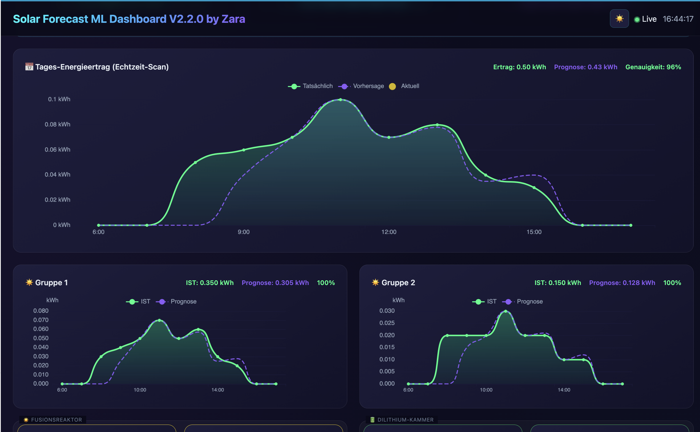
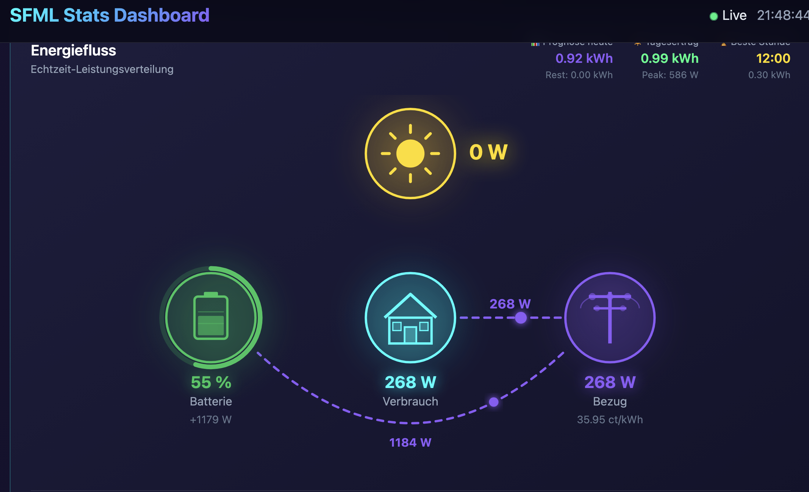

# Solar Forecast ML V12.2 "Sarpeidon" - 1st HA Full AI & ML Solar Forecast

[](https://github.com/Zara-Toorox/ha-solar-forecast-ml)
[](https://hacs.xyz/)
[](LICENSE)

<a href='https://ko-fi.com/Q5Q41NMZZY' target='_blank'></a>

**Intelligent Solar Forecasting for Home Assistant with Physics-First ML Architecture**

Imagine your smart home not just reacting, but *predicting* - using machine learning that adapts daily to your unique solar installation. That's exactly what Solar Forecast ML does. With **Version 12.2.0 "Sarpeidon"** we introduce enhanced **Multi-Weather Blending**, **Per-Panel-Group Learning**, **Learning Filters**, and the new **SFML Stats Lite** dashboard for all platforms.

<p align="center">
  
</p>

---

## What Makes This Integration Special?

Unlike simple weather API services, Solar Forecast ML learns from your real data **and** uses actual solar physics. This means:

- **Day 1:** Accurate forecasts using real physics (POA irradiance, temperature correction)
- **Week 1:** System learns your panel geometry (tilt/azimuth) automatically
- **Week 2+:** ML enhances physics predictions with local patterns (shadows, obstructions)
- **Month 1+:** 93-97% accuracy with full Physics+ML ensemble

The integration adapts to your specific roof orientation, local weather conditions, shading patterns, and seasonal characteristics - all without manual configuration.

---

## New in Version 12.2.0 "Sarpeidon"

### SFML Stats Lite (NEW)
- **Universal Dashboard** - Works on ALL platforms including Raspberry Pi and ARM
- **Real-time Energy Flow** - Visualize solar, battery, grid, and house consumption
- **Cost Tracking** - Fixed or dynamic pricing support
- **Multi-String Support** - Track up to 4 panel groups individually
- **Automated Reports** - Weekly and monthly chart generation

### Learning Filter System (NEW)
- **Intelligent Data Filtering** - Excludes anomalous hours from ML training
- **Weather Alert Detection** - Automatically flags unexpected weather events
- **Inverter Clipping Detection** - Excludes hardware-limited data points
- **Daily Learning Protection** - Skips training if >25% of data is flagged

### Clothing Recommendation (NEW in SFML Stats)
- **Weather-based Recommendations** - Suggests appropriate clothing based on forecast
- **Multi-language Support** - German and English recommendations
- **Icon-based Display** - Visual clothing suggestions

### Multi-Weather Source Blending
- **Open-Meteo + wttr.in** - Combines multiple weather sources for better cloud predictions
- **Adaptive Weight Learning** - System learns which weather source is more accurate for your location
- **Trigger-based Fetching** - Only queries secondary source when cloud cover > 50%

### Per-Panel-Group Learning
- **Individual Energy Sensors** - Configure separate kWh sensors per panel group
- **Group-specific Efficiency** - Each panel group learns its own hourly efficiency factors
- **Shadow Detection per Group** - Identifies which panels are affected by shadows

### Hourly Correction Factors
- **Hour-specific Weather Corrections** - Instead of daily averages, corrections are applied per hour
- **Morning/Afternoon Optimization** - Addresses systematic forecast biases at different times
- **7-day Rolling Learning** - Continuously improves based on recent performance

### Physics-First Architecture
The core architecture - a complete redesign from traditional solar forecasting:

- **PhysicsEngine** - Real solar physics calculations (POA, temperature correction, cell efficiency)
- **GeometryLearner** - Automatically learns your panel tilt & azimuth using Levenberg-Marquardt optimization
- **AI Neural Network** - Pure NumPy LSTM AI that captures temporal patterns
- **Residual Learning** - ML learns the difference between physics and reality
- **Weighted Ensemble** - Confidence-based blending of physics + ML predictions
- **Captain's LOG** - Monthly system health report (tilt, azimuth, seasonal tracking)

### Intelligent Detection Systems
- **Correlation-based Shadow Detection** - Distinguishes clouds from real obstructions
- **Physics-based Frost Detection** - Uses Magnus formula (dew point) for accurate frost warnings
- **Cloud Layer Physics** - Separate transmission models for low/mid/high clouds

### Unique Dashboard and statistics " SFML-STATS" BETA
- **First Home Assistant interactive Dashboard*** - Self hosted web-dashboard for local access 
- **Beautiful UX** - stunning dashboard with dark and white mode
- **Advanced statistic** - Download stunning png charts about your solar-system

### Unique Grid Price Monitoring "Grid Price Monitor" BETA
- **Germany & Austria only*** 
- **Triggers automaticaly advanced Grid Power Automations** - Automatic charging of you EV, Battery when price is low
- **Advanced statistic** - together with SFML-STATS
---

## Core Features

### Forecasting
- **3-day yield forecasts** (today, tomorrow, day after) with Physics+ML optimization
- **Hourly predictions** for detailed planning
- **Physics-based calculations** using GHI, DNI, DHI from Open-Meteo
- **Automatic panel geometry learning** - no manual tilt/azimuth configuration needed
- **Temperature-corrected efficiency** - accounts for cell temperature effects

### Machine Learning supported by AI
- **Adaptive Algorithm Selection:**
  - < 100 samples: Ridge Regression (fast, stable)
  - 100+ samples: TinyLSTM Neural Network (+5-10% accuracy)
- **14 optimized features** per hour (time, weather, astronomy, lag)
- **24-hour sequence learning** for temporal pattern recognition
- **Zero external dependencies** - pure NumPy implementation

### Analytics & Detection (AI)
- **Shadow Detection** - Correlation-based analysis separates weather from obstructions
- **Frost Detection** - Physics-based dew point calculation with Magnus formula
- **Peak hour detection** - When do you produce the most?
- **Production time calculation** - Optimized sunrise to sunset tracking
- **Self-sufficiency calculation** - How independent are you really?

### Data Privacy
- **100% local processing** - Everything calculated on your system
- **100% local AI and ML** - No ChatGPT, Claude, Gemini, Grok needed
- **No cloud services** - All data stays on your disk
- **No API keys required** - Uses free Open-Meteo API

---

## Companion Integrations

Solar Forecast ML works best with these companion integrations that extend its capabilities:

### SFML Stats (Advanced Statistics Dashboard)

<p align="center">
  
</p>

**What it does:** Provides comprehensive statistics, visualizations, and analytics for your solar production data. A powerful dashboard that visualizes solar production, battery storage, grid consumption, and energy costs in real-time. Includes the new **Clothing Recommendation** feature.

**Features:**
- Real-time energy flow visualization (solar, battery, grid, house)
- Historical production charts (daily, weekly, monthly)
- Forecast vs. actual comparison graphs
- Cost tracking with fixed or dynamic pricing
- Multi-string support (up to 4 panel groups)
- Automated weekly and monthly report generation
- Weather overlay on charts
- Dark and light theme support
- **NEW:** Clothing recommendations based on weather

**Installation:**
1. Go to Developer Tools > Services
2. Run `solar_forecast_ml.install_extras`
3. Restart Home Assistant
4. Go to Settings > Devices & Services > Add Integration > SFML Stats
5. Configure your sensors (all optional - integration works with partial config)
6. Access the dashboard at `http://YOUR_HA:8123/api/sfml_stats/dashboard`

> **Platform Compatibility for SFML Stats:**
>
> | Platform | Status | Notes |
> |----------|--------|-------|
> | x86_64 (Intel/AMD) | **Fully Supported** | Recommended |
> | Home Assistant OS (x86) | **Fully Supported** | Native installation |
> | Docker on x86 | **Fully Supported** | Standard HA container |
> | **Proxmox VE** | **Try on your own if your aware what you are doing** | no support by the developer |
> | **Raspberry Pi (ARM)** | **not supported** | Use SFML Stats Lite instead |
> | **SBC / ARM Processors** | **not supported** | Use SFML Stats Lite instead |

---

### SFML Stats Lite (For Raspberry Pi & ARM)

**What it does:** A lightweight version of SFML Stats designed specifically for Raspberry Pi and ARM devices. Provides the same energy monitoring dashboard without the heavy computational requirements.

**Features:**
- Real-time energy flow visualization (solar, battery, grid, house)
- Cost tracking with fixed or dynamic pricing
- Multi-string support (up to 4 panel groups)
- Automated weekly and monthly report generation
- Weather overlay on charts
- Dark and light theme support

**Installation:**
1. Go to Developer Tools > Services
2. Run `solar_forecast_ml.install_extras`
3. Restart Home Assistant
4. Go to Settings > Devices & Services > Add Integration > SFML Stats Lite
5. Configure your sensors (all optional - integration works with partial config)
6. Access the dashboard at `http://YOUR_HA:8123/api/sfml_stats_lite/dashboard`

> **Platform Compatibility for SFML Stats Lite:**
>
> | Platform | Status |
> |----------|--------|
> | Raspberry Pi (ARM) | **Fully Supported** |
> | All ARM devices | **Fully Supported** |
> | Proxmox VE | **Fully Supported** |
> | x86_64 (Intel/AMD) | **Fully Supported** |
> | Home Assistant OS | **Fully Supported** |
> | Docker | **Fully Supported** |

### Grid-Price Monitor

**What it does:** Monitors dynamic electricity spot prices from aWATTar (Germany & Austria) and provides smart automation triggers for optimal energy usage. Perfect for charging EVs, batteries, or running high-power appliances when electricity is cheapest.

**Features:**
- **Real-time Spot Prices** - Current and next hour prices in ct/kWh
- **Price Forecasts** - Today's and tomorrow's hourly prices (available from ~14:00)
- **Cheapest/Most Expensive Hour** - Automatically identifies optimal times
- **Binary Sensor for Automations** - `binary_sensor.cheap_energy` triggers when price is below threshold
- **Configurable Price Components** - Grid fees, taxes, VAT, provider markup
- **Calibration Mode** - Match your actual electricity bill
- **Battery Tracking** - Track how much energy was charged from grid

**Sensors:**
| Sensor | Description |
|--------|-------------|
| `sensor.grid_price_monitor_spot_price` | Current spot price (ct/kWh) |
| `sensor.grid_price_monitor_total_price` | Total price incl. fees & taxes |
| `sensor.grid_price_monitor_cheapest_hour_today` | Cheapest hour today |
| `sensor.grid_price_monitor_average_price_today` | Average price today |
| `binary_sensor.grid_price_monitor_cheap_energy` | ON when price < threshold |

**Installation:**
1. Go to Developer Tools > Services
2. Run `solar_forecast_ml.install_extras`
3. Restart Home Assistant
4. Go to Settings > Devices & Services > Add Integration > Grid Price Monitor
5. Configure:
   - **Country:** Germany (DE) or Austria (AT)
   - **VAT Rate:** 19% (DE) or 20% (AT)
   - **Grid Fee:** Your grid operator fee (ct/kWh)
   - **Taxes & Fees:** Additional taxes (ct/kWh)
   - **Max Price Threshold:** Price below which `cheap_energy` is ON

**Example Automation:**
```yaml
automation:
  - alias: "Charge EV when electricity is cheap"
    trigger:
      - platform: state
        entity_id: binary_sensor.grid_price_monitor_cheap_energy
        to: "on"
    action:
      - service: switch.turn_on
        target:
          entity_id: switch.ev_charger
```

> **Availability:** Currently supports **aWATTar** API (Germany & Austria). No API key required - uses free public market data.

**Note:** Both companion integrations require Solar Forecast ML to be installed and configured first. They share data seamlessly without additional configuration.

---

## Sensors & Diagnostics

### Core Sensors
| Sensor | Description |
|--------|-------------|
| `sensor.solar_forecast_ml_today` | Today's forecast (kWh) |
| `sensor.solar_forecast_ml_tomorrow` | Tomorrow's forecast (kWh) |
| `sensor.solar_forecast_ml_day_after_tomorrow` | Day after tomorrow (kWh) |
| `sensor.solar_forecast_ml_next_hour` | Next hour prediction (kWh) |
| `sensor.solar_forecast_ml_production_time` | Production hours today |

### ML & Analytics Sensors
| Sensor | Description |
|--------|-------------|
| `sensor.solar_forecast_ml_model_state` | ML model training status |
| `sensor.solar_forecast_ml_model_accuracy` | Current prediction accuracy (%) |
| `sensor.solar_forecast_ml_training_samples` | Number of training samples |
| `sensor.solar_forecast_ml_shadow_current` | Current shadow detection |
| `sensor.solar_forecast_ml_performance_loss` | Shadow-related losses (%) |

### Weather & Trend Sensors
| Sensor | Description |
|--------|-------------|
| `sensor.solar_forecast_ml_cloudiness_trend_1h` | 1-hour cloud trend |
| `sensor.solar_forecast_ml_cloudiness_trend_3h` | 3-hour cloud trend |
| `sensor.solar_forecast_ml_weather_stability` | Weather volatility |

---

## Services (Developer)

### ML Services (Developers only or on advice)
| Service | Description |
|---------|-------------|
| `force_retrain` | Retrain ML model with all available data |
| `reset_model` | Reset ML model to initial state |

### Bootstrap Services (Developers only or on advice)
| Service | Description |
|---------|-------------|
| `bootstrap_physics_from_history` | Train Physics+ML from HA history (up to 6 months) |
| `bootstrap_from_history` | Bootstrap pattern learning from history |

### Multi-Weather Services (Developers only or on advice)
| Service | Description |
|---------|-------------|
| `refresh_multi_weather` | Force refresh of all weather sources |
| `learn_weather_weights` | Trigger weight learning from today's data |

### Companion Integration Services
| Service | Description |
|---------|-------------|
| `install_extras` | **Main installer!** Installs/updates ALL companion modules (SFML Stats Lite, SFM-Stats, Grid Price Monitor). Run via Developer Tools > Services |

### Reset & Recovery Services
| Service | Description |
|---------|-------------|
| `borg_mode` | **Complete system reset** - Deletes ALL learned data and starts fresh. Use when: predictions are very inaccurate after 3-4 days, you changed sensors, or migrated from an older installation with corrupted data |

### Astronomy Services (Developers only or on advice)
| Service | Description |
|---------|-------------|
| `build_astronomy_cache` | Build comprehensive sun position cache |
| `refresh_cache_today` | Refresh astronomy data for current week |

### Testing & Maintenance (Developers only or on advice)
| Service | Description |
|---------|-------------|
| `test_morning_routine` | Analyze 6 AM predictions (read-only) |
| `run_all_day_end_tasks` | Manual trigger for 23:30 workflow |
| `run_weather_correction` | Rebuild corrected weather forecast |
| `send_daily_briefing` | Send formatted solar forecast notification |

---

## Installation

### HACS (Recommended)
1. Open HACS in Home Assistant
2. Go to "Integrations"
3. Click the three dots menu -> "Custom repositories"
4. Add: `https://github.com/Zara-Toorox/ha-solar-forecast-ml`
5. Select category: "Integration"
6. Install "Solar Forecast ML"
7. Restart Home Assistant
8. After Setup please wait 10-15 min and perform a 2nd Restart (needed to fill the caches)

### Manual Installation
1. Download the latest release
2. Copy `custom_components/solar_forecast_ml` to your `config/custom_components/`
3. Restart Home Assistant
4. After Setup please wait 10-15 min and perform a 2nd Restart (needed to fill the caches)

### After Updating from a Previous Version

> **Important:** After updating Solar Forecast ML, run the `install_extras` service to update all companion modules:
> ```yaml
> service: solar_forecast_ml.install_extras
> data: {}
> ```
> Then restart Home Assistant to apply the updates.

> **Having problems after updating?** If predictions are inaccurate, you configured wrong sensors in the past, or you want a complete fresh start, run the **Borg Mode** service:
> ```yaml
> service: solar_forecast_ml.borg_mode
> data: {}
> ```
> This deletes ALL learned data and lets the system relearn from scratch. Recommended after major version updates or sensor changes.

### Configuration
1. Go to Settings -> Devices & Services
2. Click "Add Integration"
3. Search for "Solar Forecast ML"
4. Configure:
   - **Power Sensor** (required): Current solar power in Watts
   - **Daily Yield Sensor** (required): Daily yield in kWh (must reset at midnight)
   - **System Capacity** (optional): Your system size in kWp
   - **Panel Groups** (optional): Format `Power(Wp)/Azimuth(deg)/Tilt(deg)/[EnergySensor]`
   - **Additional Sensors** (optional): Temperature, Lux, Radiation, etc.

---

## Panel Group Configuration (NEW in V12)

For systems with multiple panel orientations, you can configure individual groups:

**Format:** `Power(Wp)/Azimuth(deg)/Tilt(deg)/[EnergySensor]`

**Example:**
```
1425/180/9/sensor.pv_south_kwh_today
870/180/47/sensor.pv_roof_kwh_today
```

This creates:
- **Group 1:** 1425Wp, facing South (180deg), 9deg tilt, with its own energy sensor
- **Group 2:** 870Wp, facing South (180deg), 47deg tilt, with its own energy sensor

The system will learn individual efficiency factors for each group, improving overall accuracy.

---

## Quick Start After Installation

For immediate full accuracy, run the bootstrap service (Developers only or on advice):

```yaml
service: solar_forecast_ml.bootstrap_physics_from_history
data:
  days: 180  # Uses up to 6 months of history
```

This will:
1. Fetch your production history from Home Assistant
2. Get historical weather from Open-Meteo Archive
3. Train the GeometryLearner (learns panel tilt/azimuth)
4. Train the ResidualTrainer (ML corrections)
5. Your system is fully calibrated!

---

## How It Works

### Architecture: "Physics-First, ML-Enhanced"

```
+-------------------------------------------------------------------+
|  LAYER 1: DATA SOURCES                                             |
|  Open-Meteo + wttr.in (Blended) + Astronomy + Local Sensors        |
+-------------------------------------------------------------------+
|  LAYER 2: PHYSICS ENGINE                                           |
|  POA Calculation -> Temperature Correction -> Power Output         |
+-------------------------------------------------------------------+
|  LAYER 3: LEARNING ENGINE                                          |
|  GeometryLearner + ShadowLearner + WeatherPrecision + PanelGroups  |
+-------------------------------------------------------------------+
|  LAYER 4: PREDICTION ENSEMBLE                                      |
|  Physics (Rule-Based) + TinyLSTM (ML) -> Weighted Combination      |
+-------------------------------------------------------------------+
|  LAYER 5: ANOMALY DETECTION                                        |
|  Frost Detection + Shadow Detection + Cloud Physics                |
+-------------------------------------------------------------------+
```

---

## System Lifecycle

| Phase | Duration | What Happens |
|-------|----------|--------------|
| **Fresh Install** | Day 0 | Physics engine active with defaults, ~70% accuracy |
| **Initial Learning** | Day 1-7 | Geometry converges, Ridge ML available |
| **Geometry Convergence** | Day 7-14 | +/-3 deg tilt, +/-8 deg azimuth accuracy, ~85-90% |
| **ML Activation** | Day 14-30 | TinyLSTM enabled, ensemble: 70% physics + 30% ML |
| **Production** | Day 30+ | Full calibration, 93-97% accuracy |

*With `bootstrap_physics_from_history`: Skip to "Production" phase immediately!*

---

## Requirements

- Home Assistant 2024.1.0 or newer
- Power sensor (Watts)
- Daily yield sensor (kWh, resets at midnight)
- ~50 MB disk space for data files
- ~100-150 MB RAM during ML training

**Note:** Solar Forecast ML runs on all platforms including Raspberry Pi and ARM devices. Only the optional SFM-Stats companion integration requires x86_64 architecture.

### Optional but Recommended
- Lux sensor (improves shadow detection)
- Temperature sensor (improves efficiency calculation)
- Solar radiation sensor (W/m2, best for precision)

---

## Troubleshooting

### Check Logs
```bash
# Dedicated log file
/config/solar_forecast_ml/logs/solar_forecast_ml.log
```

### Common Issues

**Predictions too low?**
- Check if you have used the correct parameters (kWp = the sum of all your installed panels)
- Check if `yield-sensor` is set correctly (kWh of your panels! must reset at midnight)
- Check if `power-sensor` is set correctly (W of your panels!)

**ML not training?**
- Need 10+ samples for Ridge, 100+ for TinyLSTM
- Check `sensor.solar_forecast_ml_training_samples`

**Shadow detection wrong?**
- Ensure lux sensor is configured
- System needs clear-sky days to learn patterns

**SFM-Stats not working on Proxmox/ARM?**
- The SFM-Stats companion integration is not compatible with Proxmox or ARM-based systems
- Solar Forecast ML itself works fine on these platforms
- For SFM-Stats, please use x86_64 hardware

**Predictions very inaccurate after 3-4 days?**
- This often happens after migrating from an older version or when sensors were changed
- Old/corrupted data from previous installations can cause persistent issues
- **Solution:** Run the `borg_mode` service for a complete reset:
```yaml
service: solar_forecast_ml.borg_mode
data: {}
```
- This deletes ALL learned data and starts fresh
- After running, wait 3-7 days for the system to relearn your installation
- Consider running `bootstrap_physics_from_history` afterwards to speed up learning

---

## Contributing

Contributions are welcome! Please read our contributing guidelines and submit pull requests to the `dev` branch.

---

## License

This project is licensed under the GNU Affero General Public License v3.0 - see the [LICENSE](LICENSE) file for details.

---

## Credits

- **Developer:** [Zara-Toorox](https://github.com/Zara-Toorox)
- **Architecture Design:** Physics-First ML in Python , SFML-STATS in VUE, Grid Price Monitor in Python
- **Weather Data:** [Open-Meteo](https://open-meteo.com/) + [wttr.in](https://wttr.in/) (free, no API key required)

---

## Support

- **Issues:** [GitHub Issues](https://github.com/Zara-Toorox/ha-solar-forecast-ml/issues)
- **Discussions:** [GitHub Discussions](https://github.com/Zara-Toorox/ha-solar-forecast-ml/discussions)

---

*Made with solar power in mind*
